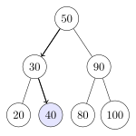

# BinarySearchTree

Binary Search tree all methods to add, remove, check cardinality, check are member. And also two test methods. This repositorie is related to datastructure
    

     
    

## Project contains:

- Interface Tree,
- Class EmptyBst,
- Class NonEmptyBst,
- Class BinarySearchTree
- Class Testers

## Build with   
   * Java

### Small description for use
 * When you will run it will show only small msg "Everything is ready to work". But in Main Class it is test calls which by default didn't send any message if everything works correct.
 Use this repo as learning material to understand Binarysearch tree as well, how it is implemented with Java.

## 👤 Author1
  * GitHub: [GintsM](https://github.com/GintsM) 
  * LinkedIn: [Gints Misins](https://www.linkedin.com/in/gints-misins-756b2321a/)

## Show your support
Give a ⭐️ if you like this project!

## 📝 License
This project is MIT licensed.
